# Reverse engineered launcher for FYT 7862/8581 with launcher creator, night mode and fuel statistics.

**Launcher Mod has been tested on Android 10 with 2000x1200 resolution as this is the only device I own.**

It should get along with all resolutions on Android 8 up to 16 provided that you install it as a privileged/system app. Android 12+ might not allow (depending on the FYT brand) to install the app with `android:sharedUserId="android.uid.system"` without root access or the proper platform keystore. This is a fundamental security restriction that cannot be bypassed. In such case you can use the non-privileged phone version (keep in mind that multiple PiP feature won't work wtihout system privileges, standard PiP should be up and running - only on FYT devices) - this version was tested on phone with Android 15.

IMPORTANT: Note that some of the FYT devices do not support the pinned PiP on the main screen. You can still use the launcher however you'll have to turn off the PiP in the launcher's settings (otherwise Google Maps will pop up every time you'll try to open the home page - if it happens, wipe the launcher's data or reinstall it).

[XDA Forums thread](https://xdaforums.com/t/reverse-engineered-launcher-for-fyt-7862-8581.4702542/)

List of modifications:
- Up to four PiPs on the single screen or on multiple screens depending on user's choice.
- ConstraintLayout which should adapt the launcher to any given resolution and orientation.
- Universal music widget (requires Notification Listener permission) that works with most of the music players (including the stock one).
- Enabled widgets (upscaled for better interaction), shortcuts and folders on the main screen. Reworked screen's grid. Extra screens as well.
- Launcher creator allowing to adjust launcher's layout to user preferences. All elements of the layout but the bottom bar might be turned off. User can also specify which screen should be the main screen.
- Bottom bar with optional widgets.
- Auto hide bottm bar option.
- Skins for widgets and bottom bar.
- Optional floating buttons allowing to quickly switch the apps between PiPs.
- Optional transparent overlay square on the status bar that detects swipes and allows to scroll between pages. This might be useful when PiP view occupies most of the visible screen (only for privileged/system app).
- Live fuel stats (requires Accessibility Service permission) with possibility to display them on the main screen and in the chosen apps with position on the screen specified by user.
- Night Mode that determines sunrise and sunset depending on the location (also allows user to manually correct the sunset and sunrise times, set the wallpaper and the brightness for the day/night mode).
- Settings fragment with useful tweaks.
- New icon for the launcher and its settings with settings' icon in the app drawer.
- "Update" feature allowing user to perform easy updates in the launcher's settings.
- Replaced part of deprecated code with the new one.


**Installation:**

For the first installation download `installer.zip`, unpack it in a FAT32 formatted USB pendrive, then connect pendrive to your unit's USB port and wait, installation should start after few seconds. Once installed you can dirty install updates (including via the built-in updater) or debug versions without using the USB pendrive again.

If installation doesn't start automatically please check other USB ports. If it doesn't start regardless the USB port, then it means that either your device is not a FYT device or indeed it is a FYT device but operates on Android 12 or higher (some brands do not allow to install apps with scripts on the USB pendrive).

Following this method is important because it installs the launcher as a privileged/system app enabling it to work properly. 

**Google Maps bug**

Most of the FYT ROMs offer two ways of displaying apps on the lauuncher's screen. The most common one is a "pinned Picture-in-Picture mode" with all it's consequences for the app's UI behavior which in Google Maps case switches the layout to minimal. This method doesn't provide essential entry points to maintain "full screen UI" for apps that support the PiP mode.
The only reliable way I have found to prevent Google Maps from switching its UI to minimal requires installed root, LSPosed and this [LSPosed module](https://github.com/vasyl91/Full-Interface-PiP/releases/tag/v1.0.1). It successfully forces the app to maintain its full UI inside FYT's Picture in Picture (remember to select Google Maps in the LSPosed "Enable module" section).
Check this [XDA thread](https://xdaforums.com/t/kernel-fyt-7862-s-8581-optimized-root-prepared-magisk-edition.4610985/) if you want to root your device. Always do the full backup (AllAppUpdate.bin, config.txt etc.) before flashing anything!

Second method related to the modified android ActivityView allows to display apps as they are in a windowed mode. This does not affect the layout and does not require root. Multiple PiP feature uses this method.


**Gallery:**

<details>

[](./images/1.png) [](./images/2.png)
[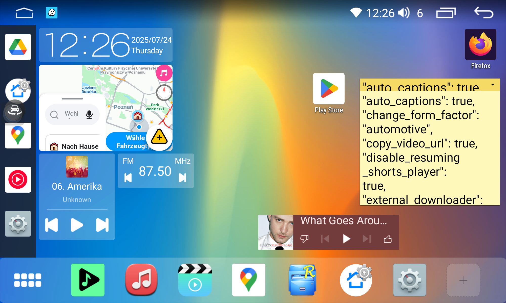](./images/4.png) [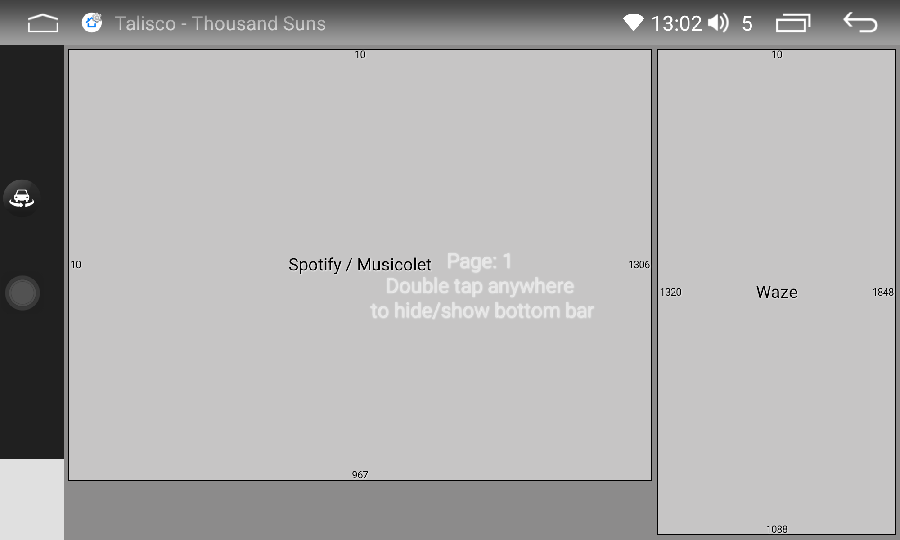](./images/5.png)
[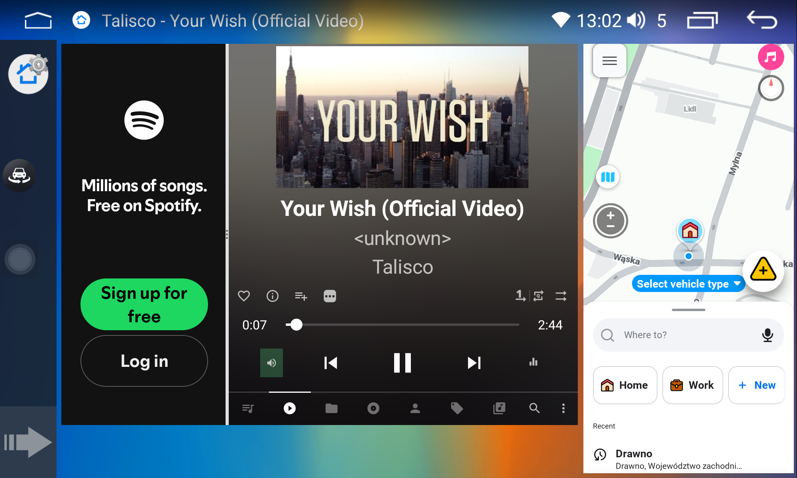](./images/6.png) [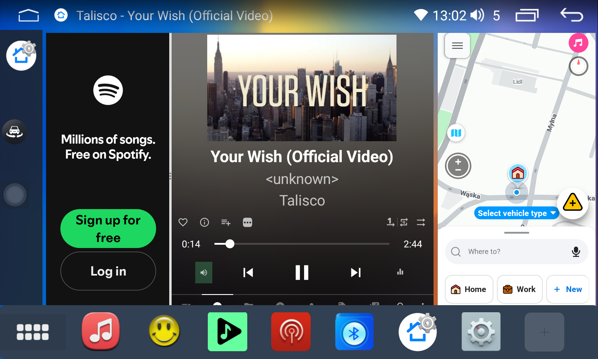](./images/7.png)
[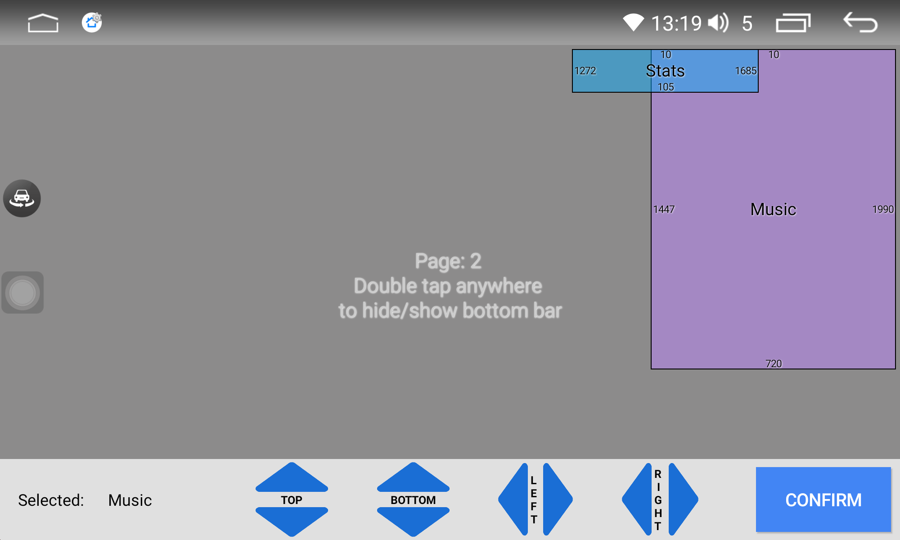](./images/8.png) [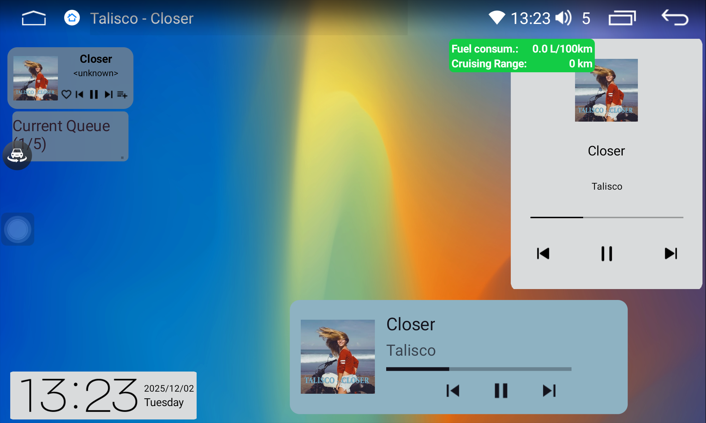](./images/9.png)
[](./images/s1.png) [](./images/s2.png)
[](./images/s3.png) [](./images/s4.png)
[](./images/s5.png) [](./images/s6.png)
[](./images/s7.png) [](./images/s8.png)
[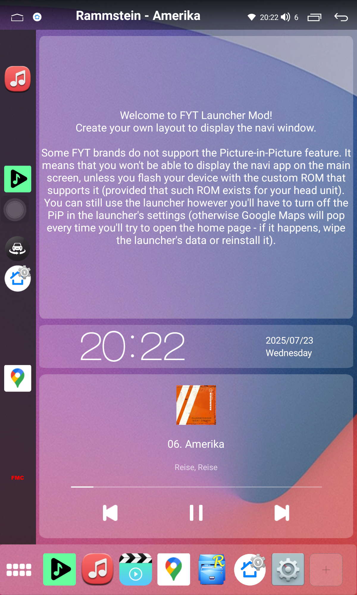](./images/v1.png) [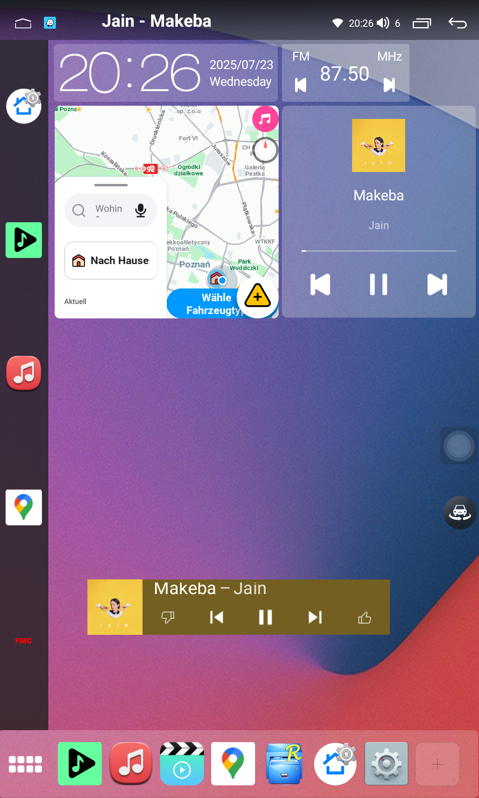](./images/v2.png)
[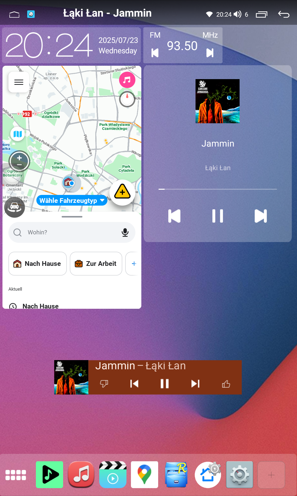](./images/v3.png) [](./images/v4.png)
[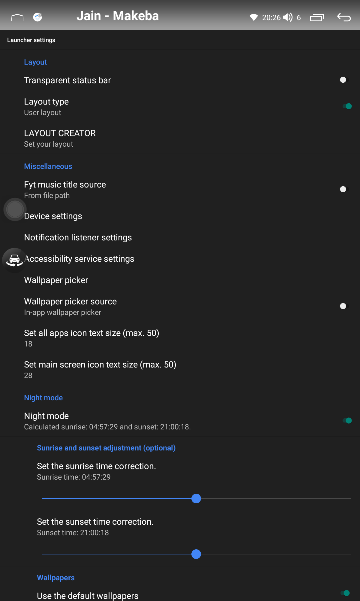](./images/v5.png) [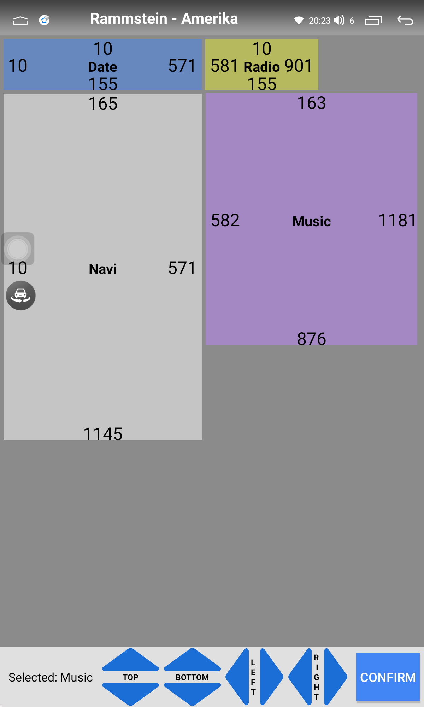](./images/v6.png)
[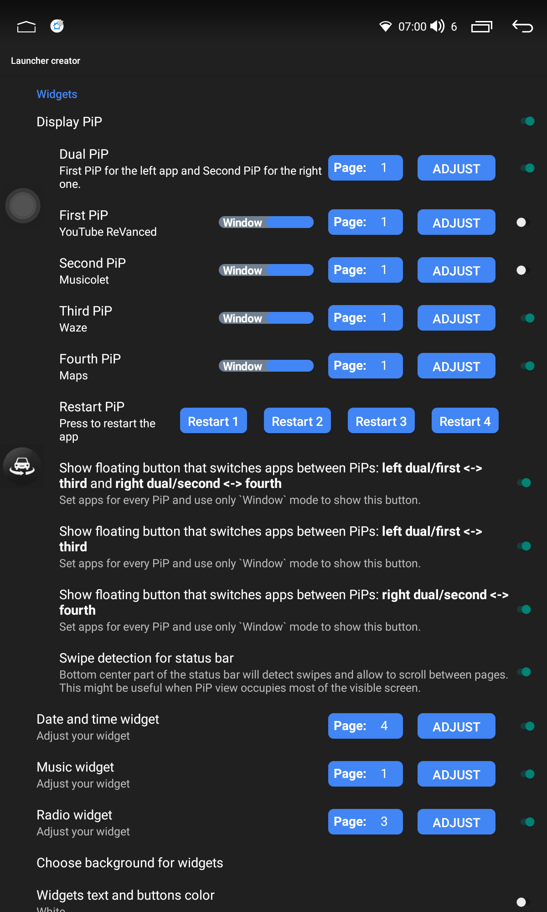](./images/v7.png) [](./images/v8.png)

</details>

**Music widget:**

<details>


</details>

**Night mode:**

<details>


</details>

**Settings:**

<details>


</details>

**In-app stats:**

<details>


</details>

## Fuel statistics

To have it working you have to find the canbus codes. Without them enabled widget will show 0 by default. Yo can do it with the help of the canbus logging tool (check the guide in the launcher's settings) or look for them manually in the source code as described below.


<details>

1. Go to the Settings > Layout creator and check what does the summary say under the Fuel statistics:

[](./images/s4.png)

2. It should contain the name of the class that canbus runs as default, in my case it is : [`com.syu.carinfo.rzc.biaozhi408.RZC_BZ408IndexActi.java`](https://github.com/vasyl91/FYT-Launcher-Mod/blob/main/fuel_stats_example/RZC_BZ408IndexActi.java). Start with that class and inspect its subclasses if needed.

3. Keep in mind that the following instruction is an example based on my case, just a hint how to do it. Moreover some units or canbusses don't provide such functionality. If your canbus app doesn't display current fuel consumption and/or cruising range then it means that you can't use this widget.

4. In gereral codes that you are looking for should be in the java file located in the same folder that the class from the step 1 is (in my case biaozhi408). Open that folder in for example Sublime and search fo `L/100KM`. If you find it proceed to the step 7. If not, follow the next steps.

5. Open the class from the step 2. and look for the method that opens the next activity that finally contains what you need, there might be few of them to check. `com.syu.carinfo.rzc.biaozhi408.RZC_BZ408IndexActi.java` contains `onClickListener` with an intent:

```
                    Intent intent = new Intent();
                    intent.setClass(RZC_BZ408IndexActi.this, RZC_BZ408OilMileIndexActi.class);
```
That leads to the class `com.syu.carinfo.rzc.biaozhi408.RZC_BZ408OilMileIndexActi.java` and you should keep looking there.

6. In [`RZC_BZ408OilMileIndexActi.java`](https://github.com/vasyl91/FYT-Launcher-Mod/blob/main/fuel_stats_example/RZC_BZ408OilMileIndexActi.java) you will find three tabs:

```
        this.mTabHost.addTab(this.mTabHost.newTabSpec("tabPage1").setIndicator("tabPage1").setContent(new Intent(this, (Class<?>) RZC_BZ408OilMilePage1Acti.class)));
        this.mTabHost.addTab(this.mTabHost.newTabSpec("tabPage2").setIndicator("tabPage2").setContent(new Intent(this, (Class<?>) RZC_BZ408OilMilePage2Acti.class)));
        this.mTabHost.addTab(this.mTabHost.newTabSpec("tabPage3").setIndicator("tabPage3").setContent(new Intent(this, (Class<?>) RZC_BZ408OilMilePage3Acti.class)));
```
`RZC_BZ408OilMilePage1Acti.class` represents the window in fyt canbus app that contains fuel statistics.

7. Finally proceed to [`com.syu.carinfo.rzc.biaozhi408.RZC_BZ408OilMilePage1Acti.java`](https://github.com/vasyl91/FYT-Launcher-Mod/blob/main/fuel_stats_example/RZC_BZ408OilMilePage1Acti.java) and you will find there the functions similar to these (I left only the crucial parts):

```
    private IUiNotify mNotifyCanbus = new IUiNotify() { 
        @Override 
        public void onNotify(int updateCode, int[] ints, float[] flts, String[] strs) {
            switch (updateCode) {
                ....
                case 102:
                    RZC_BZ408OilMilePage1Acti.this.mUpdaterOilExpend();
                    break;
                case 103:
                    RZC_BZ408OilMilePage1Acti.this.mUpdaterDrivingMileage();
                    break;
                ....
            }
        }
    };

    @Override
    protected void onCreate(Bundle savedInstanceState) {
        ....
        DataCanbus.PROXY.cmd(70, new int[]{51}, null, null);
    }

    @Override 
    public void addNotify() {
        DataCanbus.NOTIFY_EVENTS[102].addNotify(this.mNotifyCanbus, 1);
        DataCanbus.NOTIFY_EVENTS[103].addNotify(this.mNotifyCanbus, 1);
        ....
    }

    @Override 
    public void removeNotify() {
        DataCanbus.NOTIFY_EVENTS[102].removeNotify(this.mNotifyCanbus);
        DataCanbus.NOTIFY_EVENTS[103].removeNotify(this.mNotifyCanbus);
        ....
    }

    public void mUpdaterOilExpend() {
        int value = DataCanbus.DATA[102];
        ....
    }

    public void mUpdaterDrivingMileage() {
        int value = DataCanbus.DATA[103];
        ....
    }
```

8. The codes that you are looking for are inside `DataCanbus.DATA[102]`, `DataCanbus.DATA[103]`, and `DataCanbus.PROXY.cmd(70, new int[]{51}, null, null);`. The launcher setting should be updated as below:

    `Fuel: 102, Range: 103, cmdInt: 70, cmdArr: 51`

 If you have some problems with identifying these codes please look for the file in the containing folder that holds general code list for particular car (It might NOT be available for every car! In my case it is [`com.syu.carinfo.rzc.biaozhi408.Const_RZC4_PSA_ALL_DATA.java`](https://github.com/vasyl91/FYT-Launcher-Mod/blob/main/fuel_stats_example/Const_RZC4_PSA_ALL_DATA.java)).

9. If the widget still shows `0.0 L/100Km` and `0 Km` or the readings are bizzare and inadequate, then it means that your device probably uses different codes than provided in this library. To get these codes you will have to unpack the canbus app installed on your head unit. 

10. To extract the apk file please instal on your device [Apk Analyzer](https://play.google.com/store/apps/details?id=sk.styk.martin.apkanalyzer&hl=en&pli=1). Open it and type `com.syu.canbus` in the search bar. Open the result and in the next window press the three dots in the bottom right corner, then press `Export APK`. Move exported `com.syu.canbus.apk` to your PC.

11. To unpack the extracted apk please use [APKRepatcher](https://github.com/vasyl91/APKRepatcher/releases/tag/Update2024) tool. Download it and inside APKRepatcher folder hold the Shift key, then right-click an empty area and open Command Prompt from the context menu. Paste in Command Prompt `java -jar APKRepatcher.jar` and press Enter. (Install java on your PC if needed, google it).

12. In the APKRepatcher go to File > Open APK, select your `com.syu.canbus.apk` and wait till it finishes. Then go to the directory `APKRepatcher\Projects\com.syu.canbus.apk\javaCode\classes.dex\sources\com\syu` and repeat the step 2.


In my case the canbus stops sending the fuel consumption when the speed drops below 40km/h so I added function that attempts to ROUGHLY estimate the fuel consumption to provide some insight even though it undoubtedly is an inaccurate calculation. To use that you will need to find one additional code which represents RPM - `U_ENGINE_SPEED = 148;` found in [`Const_RZC4_PSA_ALL_DATA.java`](https://github.com/vasyl91/FYT-Launcher-Mod/blob/main/fuel_stats_example/Const_RZC4_PSA_ALL_DATA.java)) mentioned earlier and provide car details in app settings.

</details>

## Debugging

1. Download and install the latest debug version. 
2. Use the built-in logcat tool (see the launcher's settings) or get the logs using other software i.e. [Logcat Reader](https://play.google.com/store/apps/details?id=com.dp.logcatapp&hl=en&pli=1).
3. Open the new issue, provide information of your Android version and screen resolution, describe the error (step by step instruction for reproducing the error) and attach the logs.

I can not guarantee fixing all errors.


## Generating app in Android Studio

1. Clone the repository. 
2. Tampering with `android.jar` is deprecated since build 1.1.8.

<details>

for builds up to 1.1.6 - replace `android.jar` in `C:\Users\<UserName>\AppData\Local\Android\Sdk\platforms\android-36` with the file from this [release](https://github.com/vasyl91/FYT-Launcher-Mod/releases/download/Android-36-modded-jar/android.jar).

for build 1.1.7 use `android.jar` from this [repository](https://github.com/Reginer/aosp-android-jar) - check `targetSdk` inside `app/build.gradle.kts` and choose android version you want to work with.

</details>

3. For non-privileged devices change the beginning of the `AndroidManifest.xml` with:

<details>

```
<?xml version="1.0" encoding="utf-8" standalone="no"?>
<manifest xmlns:android="http://schemas.android.com/apk/res/android"
    xmlns:tools="http://schemas.android.com/tools">

    <queries>
        <intent>
            <action android:name="android.intent.action.INSTALL_PACKAGE" />
            <data android:mimeType="application/vnd.android.package-archive" />
        </intent>
    </queries>

    <permission
        android:name="com.android.launcher66.permission.PRELOAD_WORKSPACE"
        android:protectionLevel="privileged|signature" />
    <permission
        android:description="@string/permdesc_install_shortcut"
        android:label="@string/permlab_install_shortcut"
        android:name="com.android.launcher.permission.INSTALL_SHORTCUT"
        android:protectionLevel="dangerous"
        tools:ignore="ReservedSystemPermission" />
    <permission
        android:description="@string/permdesc_uninstall_shortcut"
        android:label="@string/permlab_uninstall_shortcut"
        android:name="com.android.launcher.permission.UNINSTALL_SHORTCUT"
        android:protectionLevel="dangerous"
        tools:ignore="ReservedSystemPermission" />
    <permission
        android:description="@string/permdesc_read_settings"
        android:label="@string/permlab_read_settings"
        android:name="com.android.launcher66.permission.READ_SETTINGS"
        android:protectionLevel="signature" />
    <permission
        android:description="@string/permdesc_write_settings"
        android:label="@string/permlab_write_settings"
        android:name="com.android.launcher66.permission.WRITE_SETTINGS"
        android:protectionLevel="signature" />
```

</details>

4. Open the repository and rebuild the project.
5. To generate the app use `keystore.jks` located in `FYT-Launcher-Mod\app`. Choose exisiting android key alias with password `android`. 

To debug the app on FYT device, connect it with your PC. For android 11 and above try to connect with Wi-Fi, USB might be problematic. If you don't have much choice then try to use the 4pin USB cable - in my case this one works fine. 
If you need the drivers please use [this ones](https://github.com/vasyl91/FYT-Launcher-Mod/releases/download/android-34-modded-jar/Unisoc+SPD+Driver.rar). 
Go to Developer options, click on the three dots in the top right corner and select the second option from the popup (both are in chineese).

[](./images/3.png)[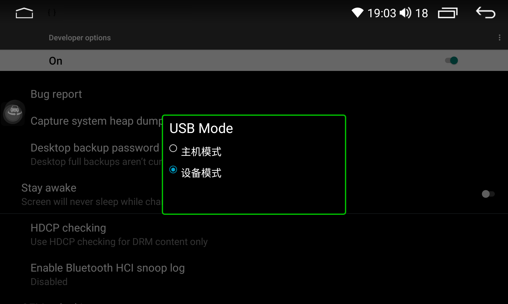](./images/3.1.png)

Remember to enable USB debugging.

If you keep getting `unauthorized` while running `adb devices` and your device doesn't display the popup to confirm the connection then it means that you'll have to add adb keys manually.
That's tricky and unfortunately requires root both on your FYT device and on your phone. If you haven't given up, follow the steps below:
1. Connect your phone to your PC and confirm the connection. 
2. Go to `/data/misc/adb/` on your phone and copy it's content (should contain `adb_keys`).
3. Paste that file in the same directory on your FYT unit.
4. Install Termux terminal on your FYT unit, open it and run the following commands `chmod 0640 /data/misc/adb/`, `chown system:shell /data/misc/adb/`, `chcon u:object_r:adb_keys_file:s0 /data/misc/adb/` (don't worry if you get some errors with the last one).


## Modifying android.jar (Deprecated since 1.1.7)

<details>

1. Download already modified [android.jar](https://github.com/Reginer/aosp-android-jar) for the android version you want to work on.
2. Download and run [Recaf](https://github.com/Col-E/Recaf).
3. Open `android.jar` in `Recaf`.
4. Open and decompile `IActivityManager.class` located in `android/app` using i.e. FernFlower decompiler.

[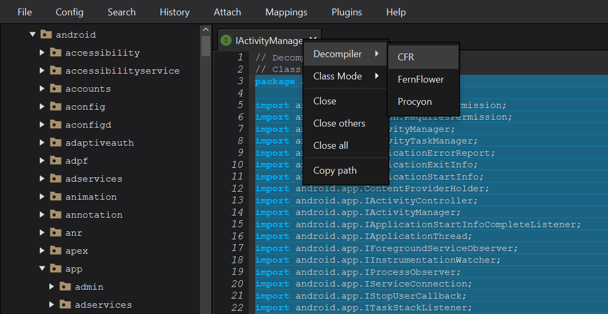](./images/IActivityManagerRecaf.png)

5. Copy the content of this file (omit the two first lines: `// Decompiled with: DecompilerName` `// Class Version: X`) and use it to create java file. Add `void setPinnedStackVisible(boolean bool);` to this file.

[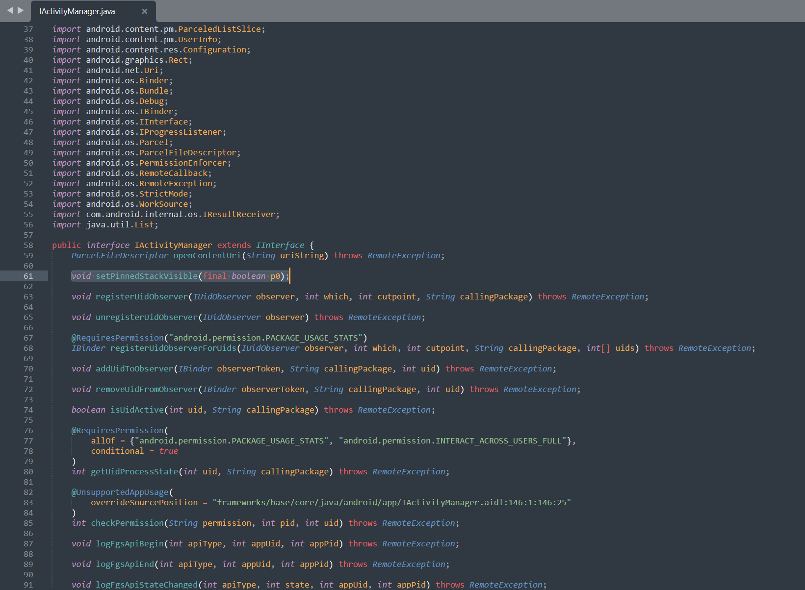](./images/IActivityManagerJava.png)

6. Download and run [Eclipse](https://eclipseide.org/).
7. In Eclipse create new Java Project `File` > `New` > `Java Project`.

[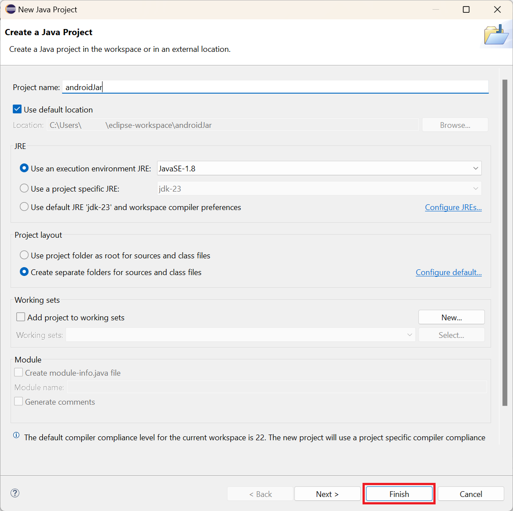](./images/IActivityManagerEclipse1.png)

8. Remove the content of this project and paste there already predefined [project's](https://github.com/vasyl91/FYT-Launcher-Mod/releases/download/Android-36-modded-jar/android_jar_eclipse.rar) files.

[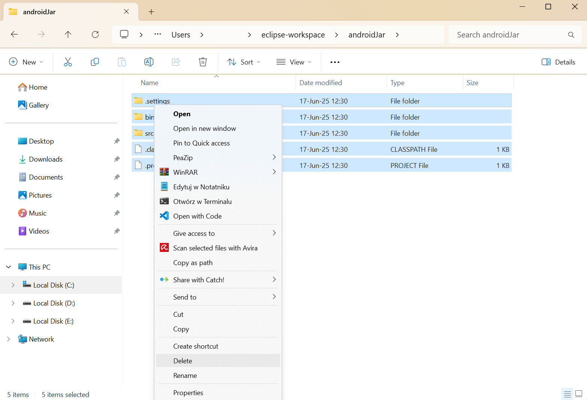](./images/IActivityManagerEclipse2.png)

9. In Eclipse refresh your project using `F5` or `Right click` on your project and `Refresh`.
10. Then `Project` > `Properties` > `Java Build Path` > `Libraries` > `Add External JARs...` > choose `android.jar` from the step 1. and press `Apply and Close`. Check if `Build automatically` is checked in the `Project` tab (should be checked by default). Refresh your project again (ignore the errors displayed at the bottom of the window).
11.  Go to `C:\Users\<your_user-name>\eclipse-workspace\androidJar\target\classes\android\app` and copy `IActivityManager.class`
12. Download [android_jar_mod.rar](https://github.com/vasyl91/FYT-Launcher-Mod/releases/download/Android-36-modded-jar/android_jar_mod.rar) and paste `IActivityManager.class` to `android_jar_mod\android\app`. Also paste `android.jar` from step 1. to `android_jar_mod\`

[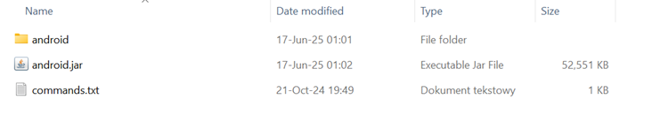](./images/IActivityManagerJar.png)

13. Press Shift + right click in the directory `android_jar_mod\`  and open `PowerShell` from the context menu. Then use in the `PowerShell` the commands provided in the `commands.txt` file (run every command one after another).
14. Finally you can use prepared `android.jar` from `android_jar_mod\` directory to run your project as described in `Generating app in Android Studio` caption.

</details>