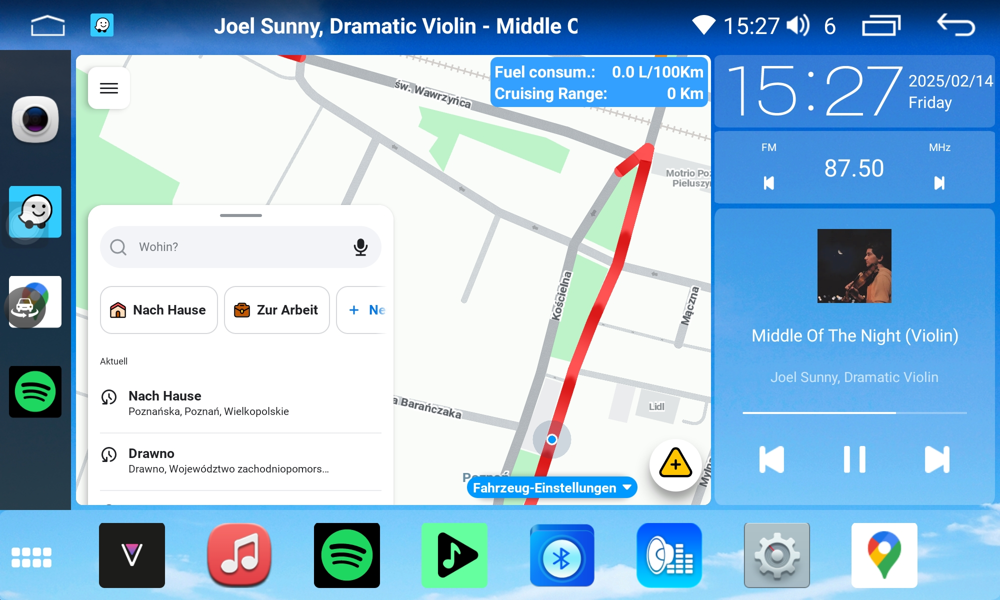
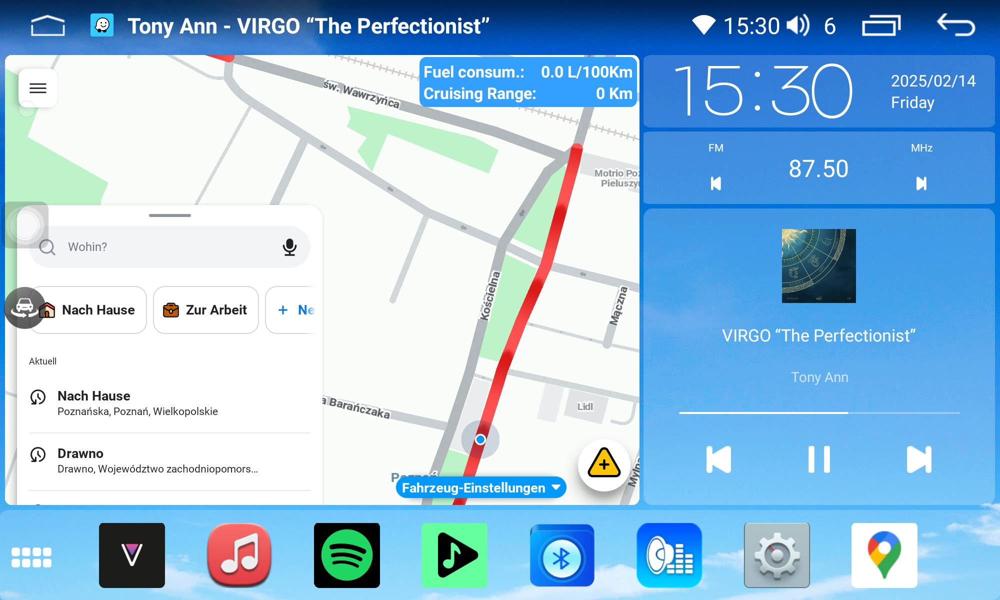

# Reverse engineered launcher for FYT 7862/8581 with launcher creator, night mode and fuel statistics.

So far tested only on 2000x1100 resolution.

List of modifications:
- Reworked music widget working with most of the music players.
- Launcher creator allowing to adjust launcher layout to user preferences.
- Live fuel stats with possibility to display them on the main screen and in the chosen apps with specified by user position on the screen.
- Night Mode that determines sunrise and sunset depending on the location (also allows user to set the wallpaper and brightness for the day/night mode).
- Settings fragment with useful tweaks.
- Replaced part of deprecated code with the new one.
- Added 1920x720 resolution.


[](./images/1.png)[](./images/2.png)

## Fuel statistics

This requires some basic coding skills so that feature probably won't be for everyone (unless it's already adjusted for your car). 
<details>
1. Go to the Settings > Layout creator and check what does the summary say under the Fuel statistics:

[](./images/Screenshot_2024-09-17_230715.jpg)

2. It should contain the name of the class that canbus runs as default, in my case it is : [`com.syu.carinfo.rzc.biaozhi408.RZC_BZ408IndexActi.java`](https://github.com/vasyl91/FYT-Launcher-Mod/blob/main/fuel_stats/RZC_BZ408IndexActi%20-%20ORIGINAL.java). This file contains stuff related to FYT canbus app that we don't want to run because it will crash the app so in order to run the fuel ststistics properly you will have to inspect some code and modify it as described below. 

3. Keep in mind that the following description is an example based on my case, just a hint how to do it.

4. Open the class from step 1. and look for the method that opens next activity that finally contains what we need which is fuel consumption and cruising range. `com.syu.carinfo.rzc.biaozhi408.RZC_BZ408IndexActi.java` contains `onClickListener` with an  intent:

```
                    Intent intent = new Intent();
                    intent.setClass(RZC_BZ408IndexActi.this, RZC_BZ408OilMileIndexActi.class);
```
That originally leads to th class `com.syu.carinfo.rzc.biaozhi408.RZC_BZ408OilMileIndexActi.java` and you should keep looking there.

5. In [`RZC_BZ408OilMileIndexActi.java`](https://github.com/vasyl91/FYT-Launcher-Mod/blob/main/fuel_stats/RZC_BZ408OilMileIndexActi.java) you will find three tabs:

```
        this.mTabHost.addTab(this.mTabHost.newTabSpec("tabPage1").setIndicator("tabPage1").setContent(new Intent(this, (Class<?>) RZC_BZ408OilMilePage1Acti.class)));
        this.mTabHost.addTab(this.mTabHost.newTabSpec("tabPage2").setIndicator("tabPage2").setContent(new Intent(this, (Class<?>) RZC_BZ408OilMilePage2Acti.class)));
        this.mTabHost.addTab(this.mTabHost.newTabSpec("tabPage3").setIndicator("tabPage3").setContent(new Intent(this, (Class<?>) RZC_BZ408OilMilePage3Acti.class)));
```
`RZC_BZ408OilMilePage1Acti.class` represents the window in fyt canbus app that contains fuel statistics.

6. Finally proceed to [`com.syu.carinfo.rzc.biaozhi408.RZC_BZ408OilMilePage1Acti.java`](https://github.com/vasyl91/FYT-Launcher-Mod/blob/main/fuel_stats/RZC_BZ408OilMilePage1Acti.java) and there you will find there the methods (I left only crucial parts):

```
    private IUiNotify mNotifyCanbus = new IUiNotify() { // from class: com.syu.carinfo.rzc.biaozhi408.RZC_BZ408OilMilePage1Acti.1
        @Override // com.syu.module.IUiNotify
        public void onNotify(int updateCode, int[] ints, float[] flts, String[] strs) {
            switch (updateCode) {
                ....
                case 91:
                    RZC_BZ408OilMilePage1Acti.this.mUpdaterOilExpend();
                    break;
                case 92:
                    RZC_BZ408OilMilePage1Acti.this.mUpdaterDrivingMileage();
                    break;
                ....
            }
        }
    };

    @Override
    protected void onCreate(Bundle savedInstanceState) {
        ....
        DataCanbus.PROXY.cmd(70, new int[]{51}, null, null);
    }

    @Override // com.syu.canbus.BaseActivity, android.app.Activity
    protected void onResume() {
        ....
        DataCanbus.PROXY.cmd(29, new int[1], null, null);
        ....
    }

    @Override 
    public void addNotify() {
        DataCanbus.NOTIFY_EVENTS[91].addNotify(this.mNotifyCanbus, 1);
        DataCanbus.NOTIFY_EVENTS[92].addNotify(this.mNotifyCanbus, 1);
        ....
    }

    @Override 
    public void removeNotify() {
        DataCanbus.NOTIFY_EVENTS[91].removeNotify(this.mNotifyCanbus);
        DataCanbus.NOTIFY_EVENTS[92].removeNotify(this.mNotifyCanbus);
        ....
    }

    public void mUpdaterOilExpend() {
        int value = DataCanbus.DATA[91];
        ....
    }

    public void mUpdaterDrivingMileage() {
        int value = DataCanbus.DATA[92];
        ....
    }
```

6. Modded [`com.syu.carinfo.rzc.biaozhi408.RZC_BZ408IndexActi.java`](https://github.com/vasyl91/FYT-Launcher-Mod/blob/main/fuel_stats/RZC_BZ408IndexActi%20-%20MOD.java) contains the methods above, do not change the methods' names, just update necessary parts - codes `91`, `92`, and `DataCanbus.PROXY.cmd(70, new int[]{51}, null, null);`, `DataCanbus.PROXY.cmd(29, new int[1], null, null);` If you have some problems with identifying these codes please look for the file in the containing folder that contains general codes list for particular car (in my case it is `com.syu.carinfo.rzc.biaozhi408.Const_RZC4_PSA_ALL_DATA.java`).

7. After updating code from step 6. please rename `RZC_BZ408IndexActi` in `public class RZC_BZ408IndexActi extends Service implements PropertyChangeListener` and the file name to the name displayed in the settings as stated in step 1., remember to update `package com.syu.carinfo.rzc.biaozhi408;` according to your class name. Replace it with original file stated in step 1.

8. Open [`AndroidManifest.xml`](https://github.com/vasyl91/FYT-Launcher-Mod/blob/main/app/src/main/AndroidManifest.xml) and look for:
```
        <!-- Replace "com.syu.carinfo.rzc.biaozhi408.RZC_BZ408IndexActi" with your class name provided in the settings -->
        <service
            android:name="com.syu.carinfo.rzc.biaozhi408.RZC_BZ408IndexActi"
            android:enabled="true"
            android:exported="true">
        </service>
```
Rename `android:name="com.syu.carinfo.rzc.biaozhi408.RZC_BZ408IndexActi"` accordingly to your newly modded file from step 7. says.

9. If everything goes well, enabling `Fuel statistics` in Settings shouldn't result in an error while going back to the launcher's main window and you should see a popup containing stats as on the screenshot below.

[](./images/Screenshot_2024-09-17_231235.jpg)
</details>


## Generating app in Android Studio

1. Clone the repository. 
2. Replace `android.jar` in `C:\Users\<UserName>\AppData\Local\Android\Sdk\platforms\android-34` with the file from this [release](https://github.com/vasyl91/FYT-Launcher-Mod/releases/download/android-34-modded-jar/android-34.rar).
3. Open the repository and rebuild the project, if I haven't forgotten anything it should work.
4. To generate the app use `keystore.jks` located in `FYT-Launcher-Mod\app`. Choose exisiting android key alias with password `android`. 

To debug the app on FYT device, connect it with your PC. For android 11 and above try to connect with Wi-Fi, USB might be problematic. If you don't have much choice then try to use 4pin USB cable - in my case this one works fine). 
If you need the drivers please use [this ones](https://github.com/vasyl91/FYT-Launcher-Mod/releases/download/android-34-modded-jar/Unisoc+SPD+Driver.rar). 
Go to Developer options, click on the three dots in the top right corner and select the second option from the popup (both are in chineese).
[](./images/3.png)

Remember to enable USB debugging.

If you keep getting `unauthorized` while running `adb devices` and your device doesn't display the popup to confirm the connection then it means that you'll have to add adb keys manually.
That's tricky. Follow the steps below (requires root on FYT and your phone):
1. Connect your phone to Android Studio and confirm the connection. 
2. Go to `/data/misc/adb/` on your phone and copy it's content (should contain `adb_keys`).
3. Paste that file in the same directory on your FYT.
4. Install Termux terminal, open it and run the following commands `chmod 0640 /data/misc/adb/`, `chown system:shell /data/misc/adb/`, `chcon u:object_r:adb_keys_file:s0 /data/misc/adb/` (don't worry if you get some error with the last one).
