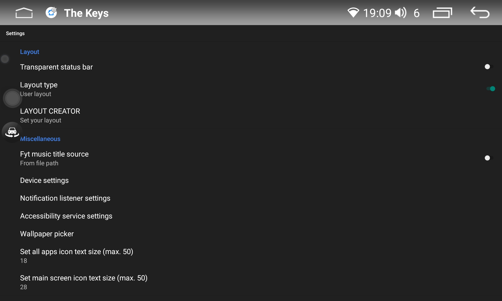
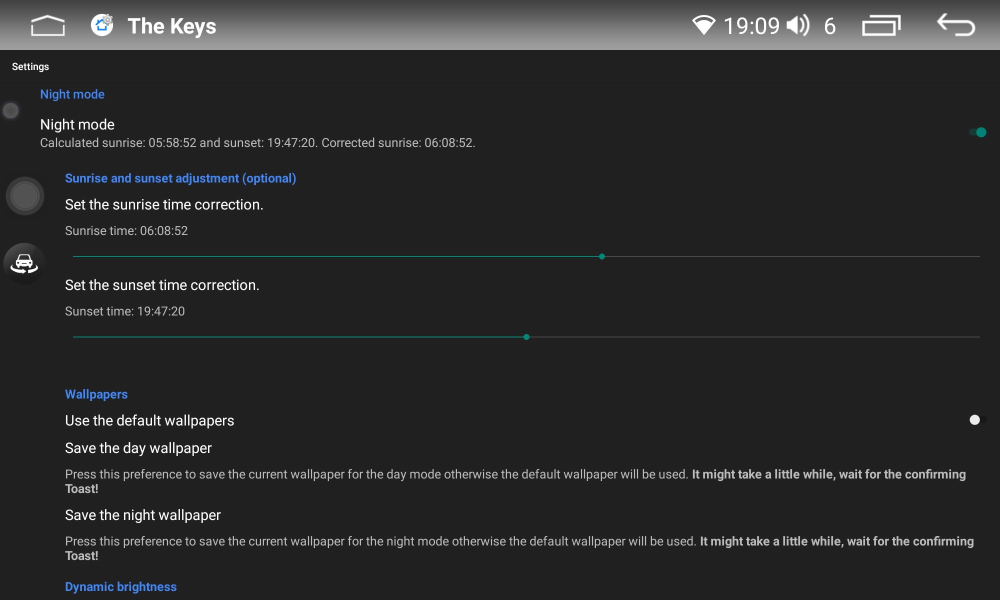
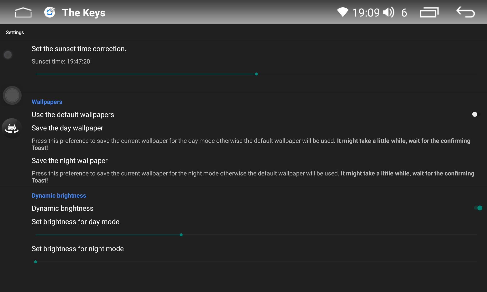
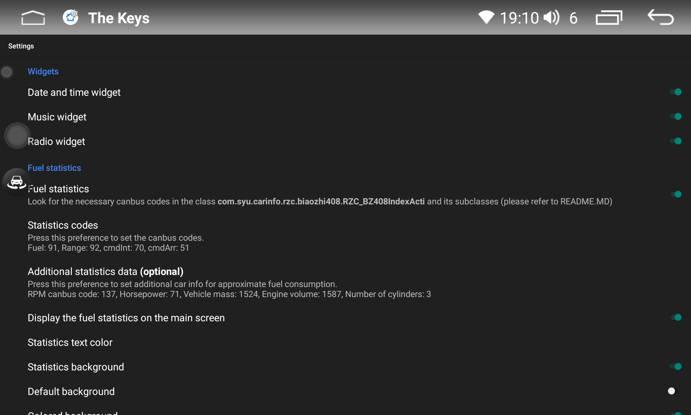
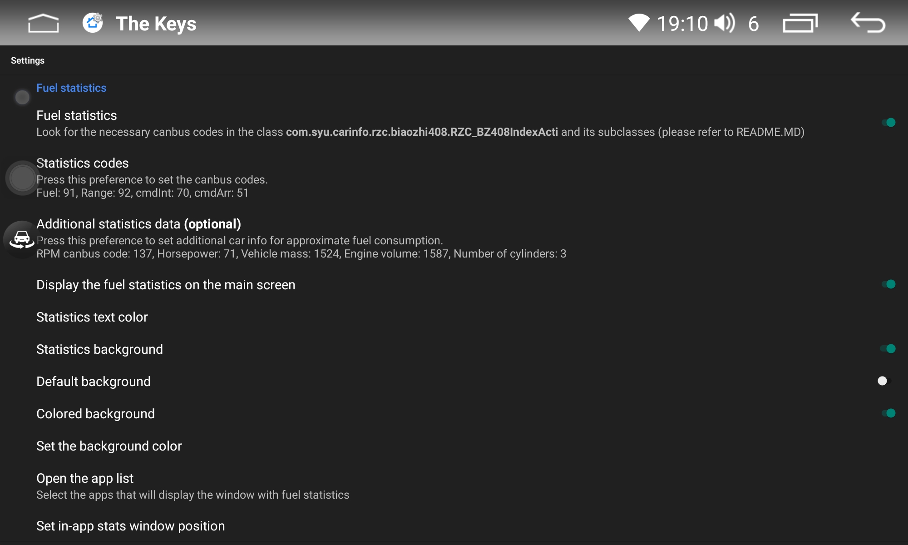

# Reverse engineered launcher for FYT 7862/8581 with launcher creator, night mode and fuel statistics.

So far the launcher has been tested on 2000x1200 resolution because this is the only device I own.

List of modifications:
- Music widget (requires Notification Listener permission) working with most of the music players.
- Widgets from external apps, shortcuts on the main screen, folders, extra screens.
- Launcher creator allowing to adjust launcher layout to user preferences.
- Live fuel stats (requires Accessibility Service permission) with possibility to display them on the main screen and in the chosen apps with specified by user position on the screen.
- Night Mode that determines sunrise and sunset depending on the location (also allows user to manually correct sunset and sunrise times, set the wallpaper and brightness for the day/night mode).
- Settings fragment with useful tweaks.
- New icon for the launcher and it's settings with settings' icon in the app drawer.
- Replaced part of deprecated code with the new one.
- Added 1920x720 resolution (needs tests).


**Gallery:**

<details>

[](./images/1.png)[](./images/2.png)
[](./images/s1.png)[](./images/s2.png)
[](./images/s3.png)[](./images/s4.png)
[](./images/s5.png)[](./images/s6.png)
[](./images/s7.png)[](./images/s8.png)

</details>

**Music widget:**

<details>


</details>

**Night mode:**

<details>


</details>

**Settings:**

<details>


</details>

**In-app stats:**

<details>


</details>

## Fuel statistics

To have it working you have to find the canbus codes in the source code. Without them enabled widget will show 0 by default.


<details>

1. Go to the Settings > Layout creator and check what does the summary say under the Fuel statistics:

[](./images/s4.png)

2. It should contain the name of the class that canbus runs as default, in my case it is : [`com.syu.carinfo.rzc.biaozhi408.RZC_BZ408IndexActi.java`](https://github.com/vasyl91/FYT-Launcher-Mod/blob/main/fuel_stats_example/RZC_BZ408IndexActi.java). Start with that class and inspect its subclasses if needed.

3. Keep in mind that the following instruction is an example based on my case, just a hint how to do it. Moreover some units or canbusses don't provide such functionality. If your canbus app doesn't display current fuel consumption and/or cruising range then it means that you can't use this widget.

4. In gereral codes that you are looking for should be in the java file located in the same folder that the class from the step 1 is (in my case biaozhi408). Open that folder in for example Sublime and search fo `L/100KM`. If you find it proceed to the step 7. If not, follow the next steps.

5. Open the class from the step 2. and look for the method that opens the next activity that finally contains what you need, there might be few of them to check. `com.syu.carinfo.rzc.biaozhi408.RZC_BZ408IndexActi.java` contains `onClickListener` with an intent:

```
                    Intent intent = new Intent();
                    intent.setClass(RZC_BZ408IndexActi.this, RZC_BZ408OilMileIndexActi.class);
```
That leads to the class `com.syu.carinfo.rzc.biaozhi408.RZC_BZ408OilMileIndexActi.java` and you should keep looking there.

6. In [`RZC_BZ408OilMileIndexActi.java`](https://github.com/vasyl91/FYT-Launcher-Mod/blob/main/fuel_stats_example/RZC_BZ408OilMileIndexActi.java) you will find three tabs:

```
        this.mTabHost.addTab(this.mTabHost.newTabSpec("tabPage1").setIndicator("tabPage1").setContent(new Intent(this, (Class<?>) RZC_BZ408OilMilePage1Acti.class)));
        this.mTabHost.addTab(this.mTabHost.newTabSpec("tabPage2").setIndicator("tabPage2").setContent(new Intent(this, (Class<?>) RZC_BZ408OilMilePage2Acti.class)));
        this.mTabHost.addTab(this.mTabHost.newTabSpec("tabPage3").setIndicator("tabPage3").setContent(new Intent(this, (Class<?>) RZC_BZ408OilMilePage3Acti.class)));
```
`RZC_BZ408OilMilePage1Acti.class` represents the window in fyt canbus app that contains fuel statistics.

7. Finally proceed to [`com.syu.carinfo.rzc.biaozhi408.RZC_BZ408OilMilePage1Acti.java`](https://github.com/vasyl91/FYT-Launcher-Mod/blob/main/fuel_stats_example/RZC_BZ408OilMilePage1Acti.java) and you will find there the functions similar to these (I left only the crucial parts):

```
    private IUiNotify mNotifyCanbus = new IUiNotify() { 
        @Override 
        public void onNotify(int updateCode, int[] ints, float[] flts, String[] strs) {
            switch (updateCode) {
                ....
                case 102:
                    RZC_BZ408OilMilePage1Acti.this.mUpdaterOilExpend();
                    break;
                case 103:
                    RZC_BZ408OilMilePage1Acti.this.mUpdaterDrivingMileage();
                    break;
                ....
            }
        }
    };

    @Override
    protected void onCreate(Bundle savedInstanceState) {
        ....
        DataCanbus.PROXY.cmd(70, new int[]{51}, null, null);
    }

    @Override 
    public void addNotify() {
        DataCanbus.NOTIFY_EVENTS[102].addNotify(this.mNotifyCanbus, 1);
        DataCanbus.NOTIFY_EVENTS[103].addNotify(this.mNotifyCanbus, 1);
        ....
    }

    @Override 
    public void removeNotify() {
        DataCanbus.NOTIFY_EVENTS[102].removeNotify(this.mNotifyCanbus);
        DataCanbus.NOTIFY_EVENTS[103].removeNotify(this.mNotifyCanbus);
        ....
    }

    public void mUpdaterOilExpend() {
        int value = DataCanbus.DATA[102];
        ....
    }

    public void mUpdaterDrivingMileage() {
        int value = DataCanbus.DATA[103];
        ....
    }
```

8. The codes that you are looking for are inside `DataCanbus.DATA[102]`, `DataCanbus.DATA[103]`, and `DataCanbus.PROXY.cmd(70, new int[]{51}, null, null);`. The launcher setting should be updated as below:

    `Fuel: 102, Range: 103, cmdInt: 70, cmdArr: 51`

 If you have some problems with identifying these codes please look for the file in the containing folder that holds general code list for particular car (It might NOT be available for every car! In my case it is [`com.syu.carinfo.rzc.biaozhi408.Const_RZC4_PSA_ALL_DATA.java`](https://github.com/vasyl91/FYT-Launcher-Mod/blob/main/fuel_stats_example/Const_RZC4_PSA_ALL_DATA.java)).

9. If the widget still shows `0.0 L/100Km` and `0 Km` or the readings are bizzare and inadequate, then it means that your device probably uses different codes than provided in this library. To get these codes you will have to unpack the canbus app installed on your head unit. 

10. To extract the apk file please instal on your device [Apk Analyzer](https://play.google.com/store/apps/details?id=sk.styk.martin.apkanalyzer&hl=en&pli=1). Open it and type `com.syu.canbus` in the search bar. Open the result and in the next window press the three dots in the bottom right corner, then press `Export APK`. Move exported `com.syu.canbus.apk` to your PC.

11. To unpack the extracted apk please use [APKRepatcher](https://github.com/vasyl91/APKRepatcher/releases/tag/Update2024) tool. Download it and inside APKRepatcher folder hold the Shift key, then right-click an empty area and open Command Prompt from the context menu. Paste in Command Prompt `java -jar APKRepatcher.jar` and press Enter. (Install java on your PC if needed, google it).

12. In the APKRepatcher go to File > Open APK, select your `com.syu.canbus.apk` and wait till it finishes. Then go to the directory `APKRepatcher\Projects\com.syu.canbus.apk\javaCode\classes.dex\sources\com\syu` and repeat the step 2.


In my case the canbus stops sending the fuel consumption when the speed drops below 40km/h so I added function that attempts to ROUGHLY estimate the fuel consumption to provide some insight even though it undoubtedly is an inaccurate calculation. To use that you will need to find one additional code which represents RPM - `U_ENGINE_SPEED = 148;` found in [`Const_RZC4_PSA_ALL_DATA.java`](https://github.com/vasyl91/FYT-Launcher-Mod/blob/main/fuel_stats_example/Const_RZC4_PSA_ALL_DATA.java)) mentioned earlier and provide car details in app settings.

</details>


## Generating app in Android Studio

1. Clone the repository. 
2. Replace `android.jar` in `C:\Users\<UserName>\AppData\Local\Android\Sdk\platforms\android-34` with the file from this [release](https://github.com/vasyl91/FYT-Launcher-Mod/releases/download/android-34-modded-jar/android-34.rar).
3. Open the repository and rebuild the project, if I haven't forgotten anything it should work.
4. To generate the app use `keystore.jks` located in `FYT-Launcher-Mod\app`. Choose exisiting android key alias with password `android`. 

To debug the app on FYT device, connect it with your PC. For android 11 and above try to connect with Wi-Fi, USB might be problematic. If you don't have much choice then try to use 4pin USB cable - in my case this one works fine). 
If you need the drivers please use [this ones](https://github.com/vasyl91/FYT-Launcher-Mod/releases/download/android-34-modded-jar/Unisoc+SPD+Driver.rar). 
Go to Developer options, click on the three dots in the top right corner and select the second option from the popup (both are in chineese).
[](./images/3.png)

Remember to enable USB debugging.

If you keep getting `unauthorized` while running `adb devices` and your device doesn't display the popup to confirm the connection then it means that you'll have to add adb keys manually.
That's tricky. Follow the steps below (requires root on FYT and your phone):
1. Connect your phone to Android Studio and confirm the connection. 
2. Go to `/data/misc/adb/` on your phone and copy it's content (should contain `adb_keys`).
3. Paste that file in the same directory on your FYT.
4. Install Termux terminal, open it and run the following commands `chmod 0640 /data/misc/adb/`, `chown system:shell /data/misc/adb/`, `chcon u:object_r:adb_keys_file:s0 /data/misc/adb/` (don't worry if you get some error with the last one).
